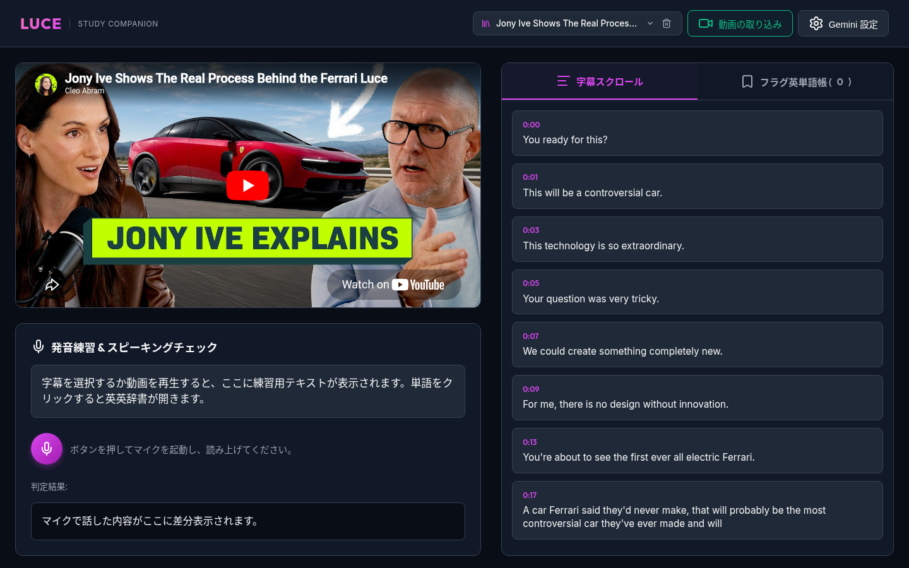
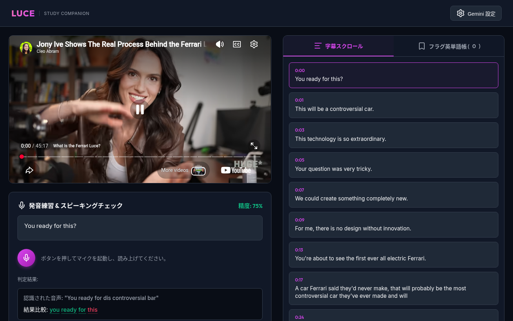
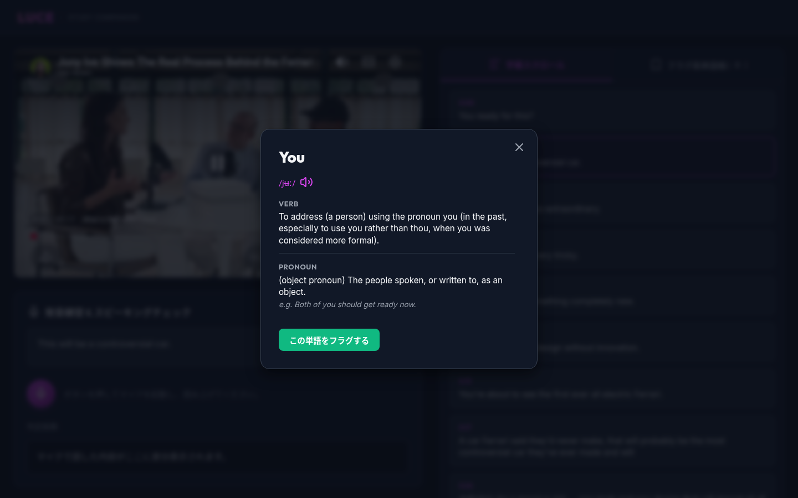
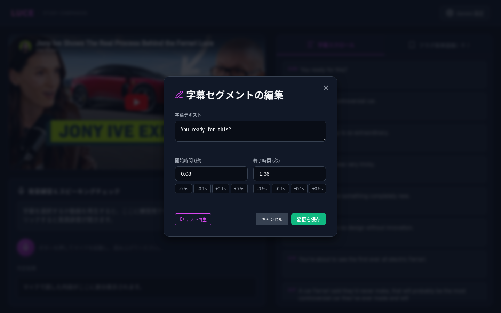
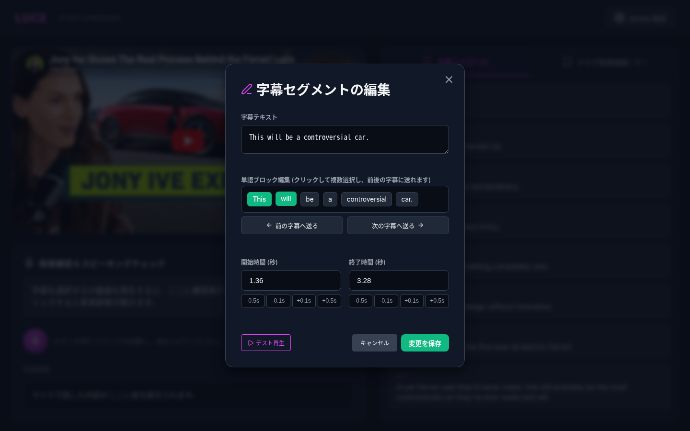
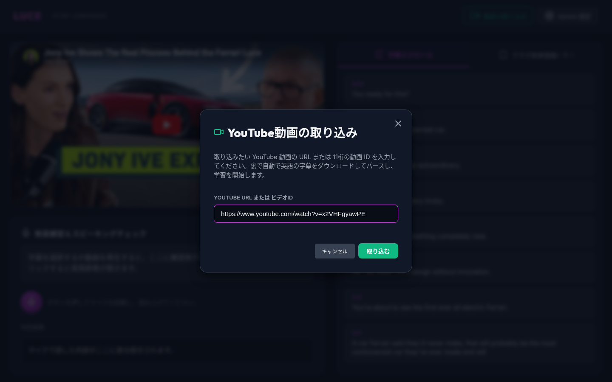

# LUCE — English Study Companion

LUCE is a lightweight, browser-based English learning tool built around YouTube videos. It fetches subtitles automatically, syncs them with video playback, and lets you practice listening, vocabulary, and speaking — all from a local server running on your machine.

---

## Screenshots

| Landing / Subtitle View | Pronunciation Result | Dictionary Pop-up |
|---|---|---|
|  |  |  |

| Subtitle Edit Mode | Word Block Editor | Video Import |
|---|---|---|
|  |  |  |

---

## Key Features

1. **Interactive Subtitle Scrolling**
   - Subtitles scroll and highlight automatically in sync with YouTube playback.
   - Click any subtitle card to jump the video to that exact moment.

2. **Instant English–English Dictionary**
   - Click any word in a subtitle to open a pop-up with its definition, phonetics, and an example sentence.
   - Hit the speaker icon inside the pop-up to hear the word pronounced.
   - Flag useful words with **"この単語をフラグする"** to save them to your vocab list.

3. **Speaking Practice & Pronunciation Checker**
   - Select a subtitle card (it appears in the practice panel on the left).
   - Press the microphone button and read the sentence aloud.
   - LUCE transcribes your speech via the Gemini API and colour-codes each word: **green** = correct, **red** = incorrect.

4. **Multiple Gemini API Key Rotation**
   - Register multiple API keys in the settings modal (one per line).
   - LUCE automatically switches to the next key when a rate-limit (HTTP 429) is hit, so practice is never interrupted.

5. **Subtitle Timing & Text Editor**
   - Fine-tune start/end times in 0.1-second increments with the ▲▼ buttons on each card.
   - Adjacent subtitles adjust automatically — no gaps or overlaps.
   - Edit the subtitle text directly in the card.
   - **Reset** all edits to the original downloaded subtitles via **Gemini 設定 → 字幕タイミングのリセット**.

6. **Visual Word Block Editor**
   - In edit mode, each word in a subtitle becomes a draggable chip.
   - Click a chip then press **← Prev** or **Next →** to move it to an adjacent subtitle card.
   - Useful for fixing word-boundary mistakes in auto-generated subtitles.

7. **Vocabulary Tab**
   - Flagged words accumulate in the **Vocab** tab (right panel).
   - Review your saved words and remove any you no longer need.

8. **Multiple Video Library**
   - Import any YouTube video by URL or 11-character Video ID.
   - Switch between imported videos via the dropdown in the header.
   - Delete a video (removes it from the library and cleans up its local subtitle data).

---

## Tech Stack

| Layer | Technology |
|---|---|
| Frontend | Vanilla HTML5 / CSS3 / JavaScript |
| Fonts & Icons | Google Fonts (Inter, Outfit), Lucide Icons |
| Video Player | YouTube IFrame Player API |
| Backend | Python 3 — `http.server` + custom REST API (`server.py`) |
| Subtitle fetch | `yt-dlp` |
| Speech-to-text | Google Gemini API |

---

## Prerequisites

Make sure the following are installed before running LUCE:

### 1. Python 3.x
```bash
python3 --version
```

### 2. yt-dlp
```bash
# via pip
pip install yt-dlp

# or via Homebrew (macOS)
brew install yt-dlp
```

### 3. Gemini API Key
Get a free key from [Google AI Studio](https://aistudio.google.com/). The free tier is sufficient for personal use.

---

## Setup & Getting Started

### Step 1 — Clone the repository
```bash
git clone https://github.com/kontty08/LUCE-english-helper.git
cd LUCE-english-helper
```

### Step 2 — Start the local server
```bash
python3 server.py
```

You should see:
```
Serving on http://127.0.0.1:8000
```

The server must keep running in the background while you use the app.

### Step 3 — Open in your browser
Navigate to:
```
http://127.0.0.1:8000
```

### Step 4 — Configure your Gemini API Key
1. Click **Gemini 設定** (top-right corner).
2. Paste your API key into the text area (one key per line for multiple keys).
3. Optionally select the Gemini model (`gemini-2.0-flash` recommended for speed).
4. Click **設定を保存**.

> API keys are stored in your browser's `localStorage` and never sent anywhere except directly to the Gemini API.

### Step 5 — Import a YouTube video
1. Click **動画の取り込み** (green button, top-right).
2. Paste a YouTube URL or Video ID (e.g. `https://www.youtube.com/watch?v=xxxxxxxx` or just `xxxxxxxx`).
3. Click **取り込む**.
4. LUCE downloads English subtitles via `yt-dlp` and loads the video. This takes a few seconds.

> **Note:** The video must have English subtitles available (manual or auto-generated). Videos without any English subtitles will fail to import.

---

## Detailed Usage Guide

### Watching & Navigating Subtitles
- Play the YouTube video — subtitles scroll and highlight automatically.
- **Click any subtitle card** to seek the video to that timestamp.
- Use the **Subtitles / Vocab** tab buttons (right panel) to switch views.

### Practising Pronunciation
1. Click a subtitle card to load it into the **practice panel** (left side).
2. Read the sentence silently first to understand it.
3. Press **🎙 (microphone)** and speak the sentence clearly.
4. Press **⏹ (stop)** or wait — LUCE sends the audio to Gemini for transcription.
5. Your result appears below the target text: green words are correct, red words need more practice.
6. Press **✕ (cancel)** to discard a recording and start over.

### Looking Up Words
- Click any word in a subtitle or in the practice panel.
- The dictionary pop-up shows: **pronunciation** · **part of speech** · **definition** · **example sentence**.
- Click **🔊** to hear the word spoken aloud.
- Click **この単語をフラグする** to save it to your Vocab list.

### Editing Subtitles
- Each subtitle card has an **edit icon** — click it to enter edit mode for that card.
- **Timing**: use ▲ / ▼ next to the start and end times (0.1 s per click).
- **Text**: click directly on the subtitle text to edit it.
- **Word blocks**: in edit mode, words become chips — use **← Prev** / **Next →** to redistribute words across adjacent cards.
- Changes are saved automatically to `localStorage` in your browser (they persist across page reloads).
- To undo all edits: **Gemini 設定 → 字幕タイミングのリセット**.

### Managing the Video Library
- The **header dropdown** lists all imported videos — select one to switch.
- The **🗑 (trash) icon** next to the dropdown deletes the currently selected video from the library.

---

## Troubleshooting

| Problem | Likely cause | Fix |
|---|---|---|
| `yt-dlp` not found | Not installed or not in PATH | `pip install yt-dlp` or `brew install yt-dlp` |
| Import fails — no subtitles | Video has no English subtitles | Try a different video; check on YouTube manually |
| Microphone button does nothing | Browser microphone permission denied | Allow microphone access in your browser settings |
| Pronunciation check fails (429) | Gemini API rate limit hit | Add more API keys in **Gemini 設定** |
| Video won't play | YouTube IFrame API blocked | Check your internet connection or browser ad-blocker |
| Subtitles out of sync | Auto-generated subtitles are approximate | Use the timing editor to adjust individual cards |

---

## License

This project is licensed under the [MIT License](LICENSE).

---

---

# LUCE — 英語学習アシスタント（日本語）

LUCEは、YouTube動画を使ってリスニング・語彙・スピーキングを練習できるローカル動作の英語学習ツールです。

---

## 主な機能

1. **連動スクロール字幕**
   - 動画の再生に合わせて字幕が自動スクロール・ハイライト表示されます。
   - 字幕カードをクリックすると、そのタイムスタンプに動画がジャンプします。

2. **インスタント英英辞書**
   - 字幕内の単語をクリックするとポップアップが開き、発音記号・意味・例文を表示します。
   - 🔊アイコンで単語の発音を再生できます。
   - 「この単語をフラグする」で単語をVocabリストに保存できます。

3. **発音チェック・スピーキング評価**
   - 字幕カードを選択してマイクボタンを押し、声に出して読みます。
   - Gemini APIで音声を文字起こしし、正しく言えた単語を**緑**、言えなかった単語を**赤**で表示します。

4. **複数APIキーの自動ローテーション**
   - 設定画面に複数のGemini APIキーを登録可能（1行1キー）。
   - 429エラー（レート制限）発生時に自動で次のキーへ切り替えます。

5. **字幕タイミング・テキスト編集**
   - 各字幕の開始・終了時間を0.1秒単位で微調整できます。
   - 前後の字幕と自動で整合が取られ、隙間や重複が生じません。
   - 字幕テキストの直接編集も可能。
   - 編集データはブラウザの `localStorage` に自動保存されます。
   - 「Gemini 設定 → 字幕タイミングのリセット」ですべての編集を元に戻せます。

6. **単語ブロックエディタ**
   - 編集モードで各単語がチップ表示になり、隣の字幕カードへワンクリックで移動できます。
   - 自動生成字幕の単語境界ずれを手軽に修正できます。

7. **単語帳（Vocabタブ）**
   - フラグした単語が右パネルの「Vocab」タブに蓄積されます。

8. **複数動画ライブラリ**
   - YouTubeのURLまたはVideo IDを入力して動画を追加インポートできます。
   - ヘッダーのドロップダウンで動画を切り替え、🗑アイコンで削除できます。

---

## 動作要件

- Python 3.x
- `yt-dlp`
  ```bash
  pip install yt-dlp
  # macOS (Homebrew):
  brew install yt-dlp
  ```
- Google Gemini APIキー（[Google AI Studio](https://aistudio.google.com/) で無料取得）

---

## セットアップ

```bash
# 1. クローン
git clone https://github.com/kontty08/LUCE-english-helper.git
cd LUCE-english-helper

# 2. サーバー起動
python3 server.py

# 3. ブラウザで開く
# http://127.0.0.1:8000
```

起動後、「**Gemini 設定**」からAPIキーを登録し、「**動画の取り込み**」でYouTubeのURLを入力すれば学習を開始できます。

---

## トラブルシューティング

| 症状 | 原因 | 対処 |
|---|---|---|
| 動画インポートが失敗する | yt-dlpが見つからない / 英語字幕なし | `pip install yt-dlp` を実行 / 別の動画を試す |
| 発音チェックが動かない | マイク権限が未許可 | ブラウザのマイク許可を有効にする |
| 429エラーが出る | Gemini APIのレート制限 | 設定画面でAPIキーを追加登録する |
| 字幕がずれている | 自動生成字幕の精度 | タイミングエディタで個別に調整する |
